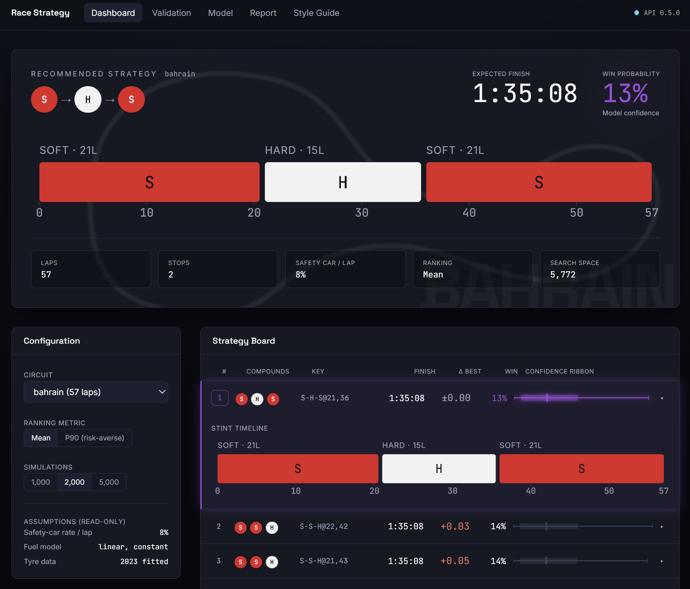
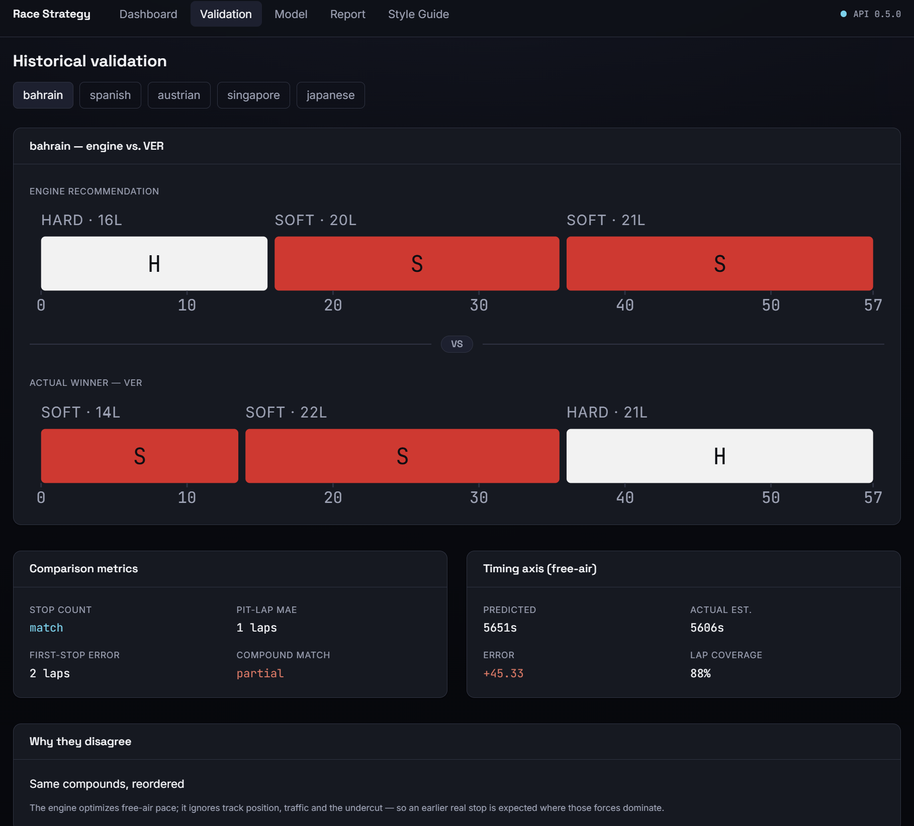
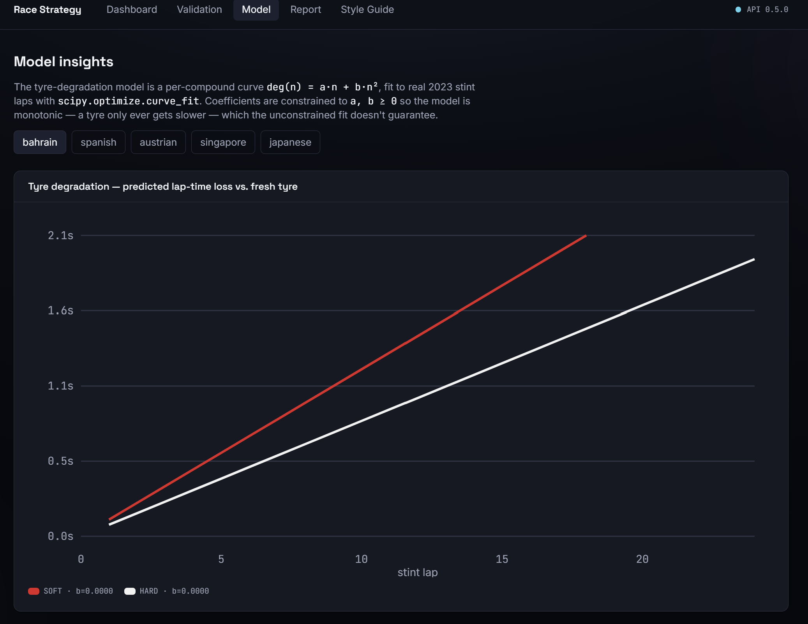
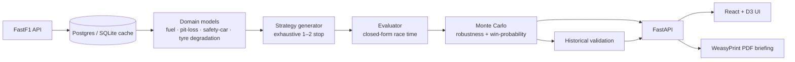

# Race Strategy Decision Engine

**An F1 pit-stop strategy engine built on real timing data — it enumerates every legal strategy,
stress-tests the best ones with Monte Carlo, and validates itself against what teams actually did in
2023.**


**🔗 Live demo — [race-strategy-decision-engine.vercel.app](https://race-strategy-decision-engine.vercel.app)**

> Not a toy. It runs on **real FastF1 timing data**, every domain model is **fit to that data and
> unit-tested**, and the whole engine is **validated against real race outcomes** — with the
> disagreements measured and explained, not hidden.





---

## What it does

Given a circuit, the engine:

1. **Enumerates** every legal 1- and 2-stop strategy (~5k–45k per race) respecting the FIA
   two-compound rule and a minimum stint length.
2. **Evaluates** each in closed form — base pace + tyre degradation + fuel burn-off + pit loss — in
   well under a second, no solver required.
3. **Stress-tests** the strongest shapes with a **Monte Carlo** layer: discrete safety-car events and
   degradation noise, sharing scenarios across strategies (common random numbers) so it can compute a
   real **win probability** per shape.
4. **Validates** itself: for each cached 2023 race it compares its free-air optimum to what the winner
   actually did, and reports the error with a plain-English reason for every disagreement.
5. **Serves** all of this over a typed FastAPI, a React + D3 pit-wall UI, and a one-page
   **WeasyPrint PDF** briefing.

The honest framing is the point: the engine optimizes **free-air pace**. It does **not** model track
position, traffic, or the undercut — so where it disagrees with reality, that gap *is* the insight.

---

## Architecture



| Layer | Tool | Why |
|---|---|---|
| Data | **FastF1** | Real, legitimate F1 timing data via a public API |
| Analysis | **pandas · numpy · scipy** | Curve-fit degradation coefficients from real telemetry, not guessed |
| Persistence | **PostgreSQL + SQLAlchemy** | Cache slow FastF1 pulls; a bundled SQLite snapshot ships to prod |
| Backend | **FastAPI + Pydantic** | Typed, self-documenting HTTP API (`/docs`) |
| Frontend | **React + Vite + TypeScript** | Fast, typed UI |
| Charts | **D3.js** | One charting library, used deeply |
| Report | **Jinja2 → WeasyPrint** | A real downloadable PDF briefing |
| Tests | **pytest · Vitest** | 139 tests across domain models, engine, API, and UI |
| Deploy | **Docker · Railway · Vercel** | One-command local run; container to prod |

---

## Validation results

Tested against **5 generatable 2023 races** (Australia is excluded — after the data-quality gate only
one compound survives, so no two-compound strategy is possible).

| Race | Stop count | Pit-lap MAE | Compound | Timing error | Explanation |
|------|:----------:|:-----------:|:--------:|:------------:|-------------|
| Bahrain | ✅ | 1.0 laps | ~ | +45.3 s | Same compounds, reordered |
| Spanish | ✅ | 9.0 laps | ❌ | +22.1 s | Team ran long (overcut) |
| Austrian | ✅ | 5.5 laps | ~ | +86.2 s | Team ran long (overcut) |
| Singapore | ❌ | N/A | ❌ | −0.3 s | Actual 1-stop vs engine's 2-stop |
| Japanese | ✅ | 2.0 laps | ❌ | +16.1 s | Early undercut |

**Headline:** pit-lap MAE **4.38 laps**, first-stop MAE **4.2 laps**, 1/5 stop-count mismatches, mean
absolute timing error **34 s**.

Two findings that are the validation *working*, not failing:

- **A systematic ~0.5 s/lap timing bias** — the engine's free-air time runs consistently slower than
  the winners' realized green pace, a mild over-estimate of cumulative degradation the point-metric
  can't see but the independent timing axis can.
- **Singapore's genuine strategic disagreement** — the engine wants two stops; Sainz won on one, held
  in place by track position and a late safety car, exactly the forces a free-air model omits.

---

## Assumptions, Limitations & honesty

**Assumptions**
- Constant fuel-burn rate; no mid-race rain transitions.
- Fixed tyre allocation; safety-car probability from a **published per-circuit table**, upgraded to a
  data estimate automatically once ≥2 races per circuit are cached.
- No driver-error modeling.

**Limitations**
- No dirty-air / following-car pace loss, tyre graining, track evolution, or team-order interaction.
- Compound *pace* is a documented constant, not a fit — it's collinear with race phase and
  genuinely unidentifiable from race data (proved with three successively stronger estimators). Same
  for compound base pace and pit loss: quantities the data can't identify are **filled with published
  constants and clearly labelled**, never silently guessed.

This "say what the data can and can't tell you" discipline is deliberate — it's what makes the
validation numbers above trustworthy.

**Design integrity (frontend).** The UI borrows two real motorsport conventions and enforces them in
code: **FIA tyre colors encode compound only** (never generic UI color), and **purple is reserved for
the single fastest / most-probable result in view**. A grep gate keeps hex out of components so the
palette lives in one token file.

---

## Run it locally

**Prerequisites:** Docker, Node 18+, Python 3.11.

```bash
# 1. Backend + database (one command — serves on :8000, Swagger at /docs)
docker compose up --build backend

# 2. Frontend (in another terminal)
cd frontend
npm install
npm run dev            # http://localhost:5173
```

The backend container ships with a **bundled SQLite snapshot** of the six cached races, so it needs no
external database. For development against Postgres, `docker compose up db` and run the backend with
the local `uvicorn` (see `backend/`).

### Tests

```bash
cd backend && pytest tests/ -q          # 125 passing (2 PDF tests skip without WeasyPrint's native libs)
cd frontend && npm run build && npm test # type-check + 14 Vitest tests
```

---

## Project structure

```
backend/
  app/
    models/     # domain physics: fuel, pit-loss, safety-car, tyre degradation (scipy fits)
    engine/     # strategy generation, evaluation, Monte Carlo, historical validation
    api/        # FastAPI routers, Pydantic schemas, services
    report/     # Jinja2 template + WeasyPrint PDF renderer
  scripts/      # fetch races, fit curves, run validation, export SQLite
  tests/        # 125 tests
frontend/
  src/
    components/ # design-system primitives + D3 charts (ribbon, timeline, histogram, degradation)
    pages/      # Dashboard, Validation, Model insights, Report, Style guide
    lib/        # typed API client, formatting, tyre/stint helpers
docker-compose.yml   # db + backend
```

---

## Roadmap

- Multi-season / more circuits; live FastF1 refresh in production.
- Reactive pitting under safety car (currently evaluate-only).
- Correlated cross-stint degradation (shared per-race track factor).
- Calibrating the Monte Carlo constants against the validation set (carefully — 5 races).

See [DEPLOY.md](DEPLOY.md) for the Railway + Vercel deployment guide, and
[CHANGELOG.md](CHANGELOG.md) for the release history.

## License

[MIT](LICENSE).

